# RainFall-Analysis-and-Prediction
Rainfall analysis and prediction shows rainfall analysis across 35 subdivisions of India using rainfall data of over 115 years. For prediction linear regression is used. project is developed in python
## screeenshots
GUI 1. Homepage
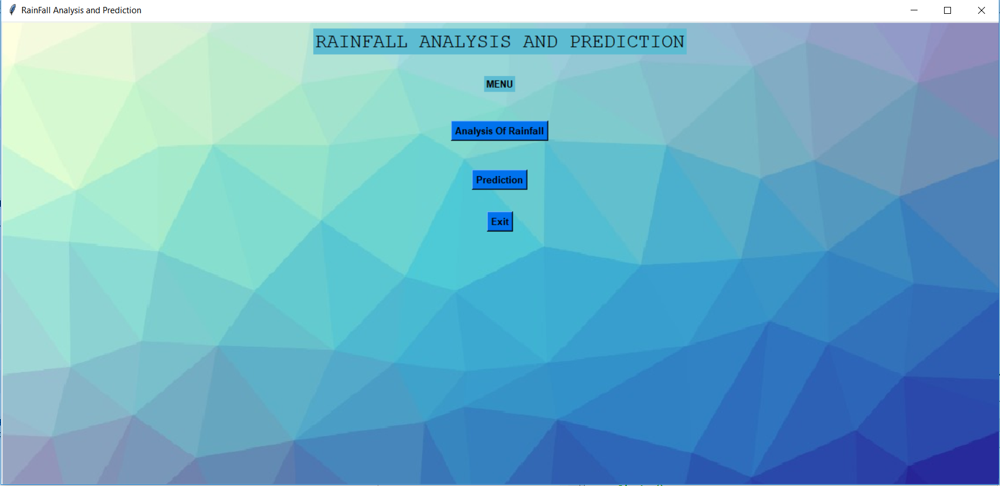

GUI 2. Analysis
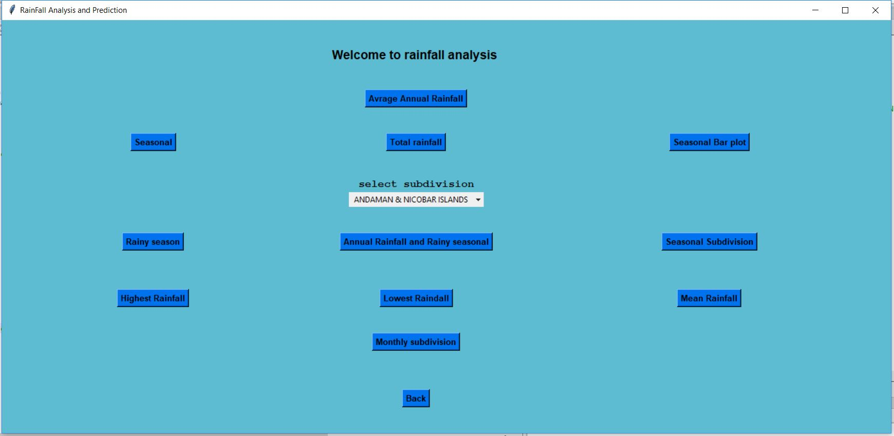

GUI 3. Prediction
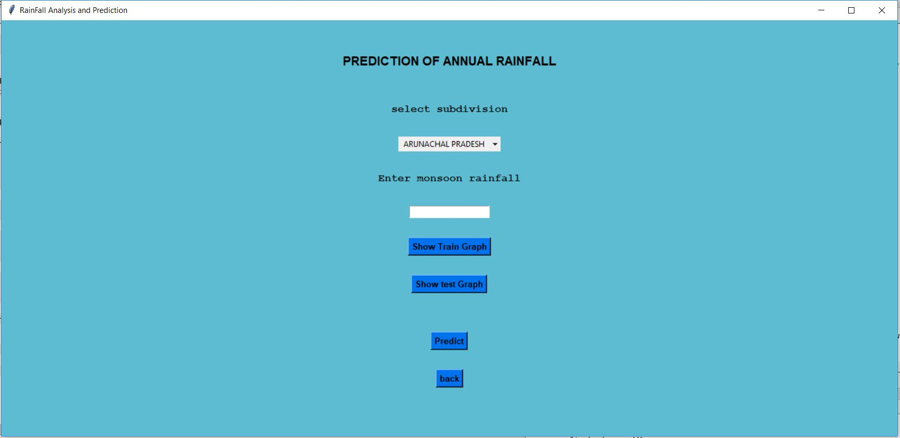

GUI 4. Result
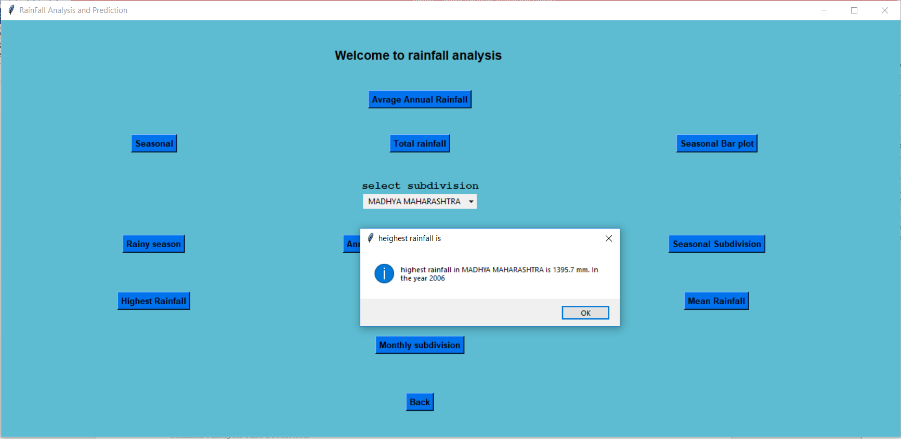

GUI 5. Prediction result
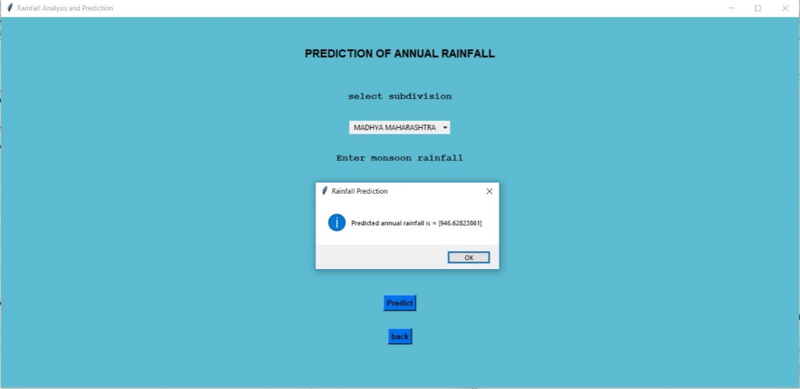

Algorithm : Flowchart for model training
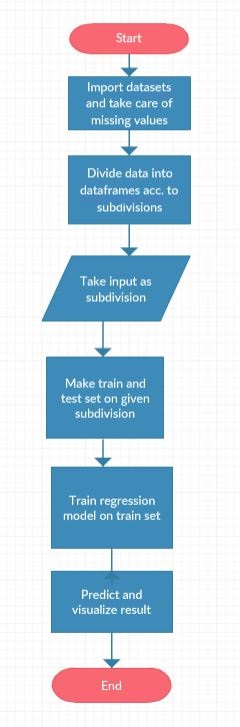

Result 1. Subdivision wisse rainfall
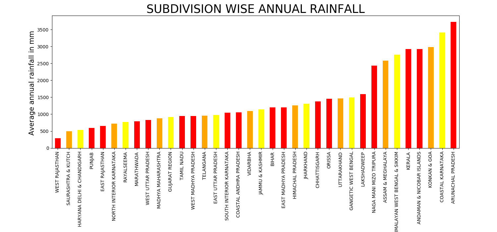

Result 2. Total annual rainfall vs years
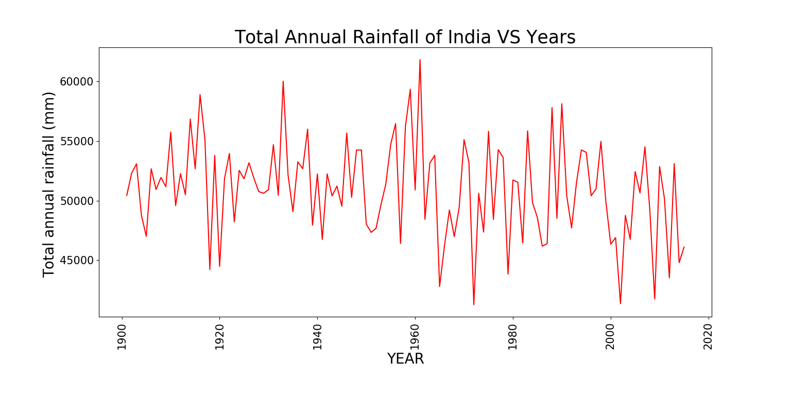

Result 3. Pie chart
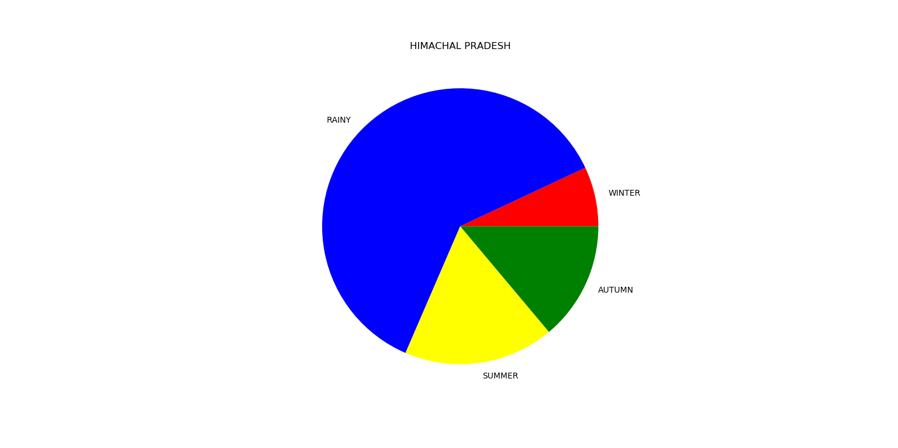

Result 4. Seasonal (described by months)
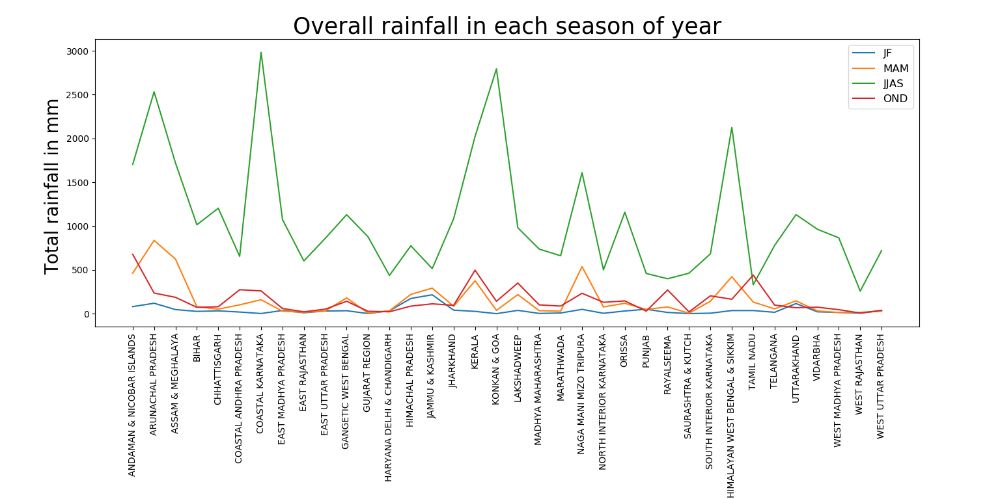

Train for prediction

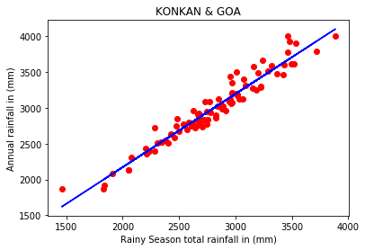

Test for prediction

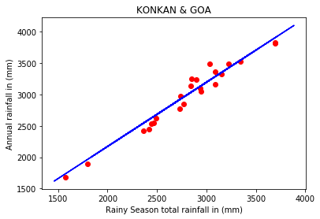
